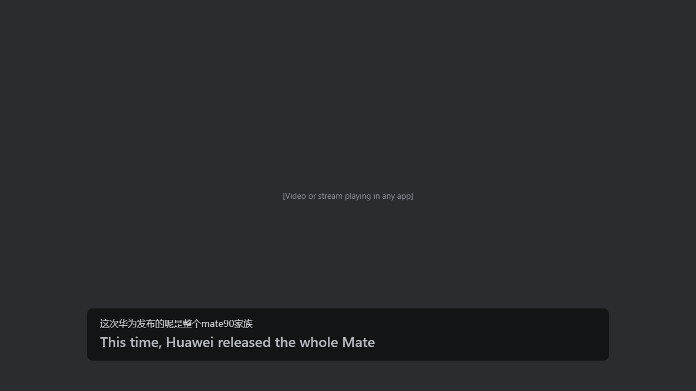

# Live Translation

Live English captions for Chinese speech on Windows. All processing is on the PC.

The app captures the audio that the PC plays (all audio, or only selected apps). It recognizes the Chinese with SenseVoice and translates it with two local llama.cpp models. The Chinese and a dimmed draft translation appear in approximately one second. The final translation then replaces the draft.



Rust core, Tauri 2 shell, Svelte UI. Translation: Hy-MT2 1.8B for finals, LMT-60 0.6B for drafts.

## Requirements

- Windows 10 or 11, x86-64, AVX2, 4 cores and 8 GB RAM minimum (6 cores and 16 GB recommended).
- For development: Rust (rustup), Node.js 22.12+, Python 3.11+, Visual Studio Build Tools with "Desktop development with C++".

## Quick start

```powershell
git clone <repo-url> live-translation
cd live-translation
./scripts/setup.ps1 -Models      # check tools, download runtimes, packages and models
./scripts/check.ps1              # all checks

. ./scripts/env.ps1
npm --prefix app/ui run build
cargo run -p live-translation    # the app
```

`./scripts/package.ps1 -Version 0.2.0` makes the zip in `dist/`.

## Models

The repository does not contain models. The app downloads them at first run. Developers use `scripts/setup.ps1 -Models`. See [docs/models.md](docs/models.md).

## Documents

- [Architecture](docs/architecture.md)
- [Development](docs/development.md)
- [Configuration](docs/configuration.md)
- [Core ↔ UI contract](docs/ipc.md)
- [Models and runtime](docs/models.md)
- [User guide](docs/USER-README.md)
